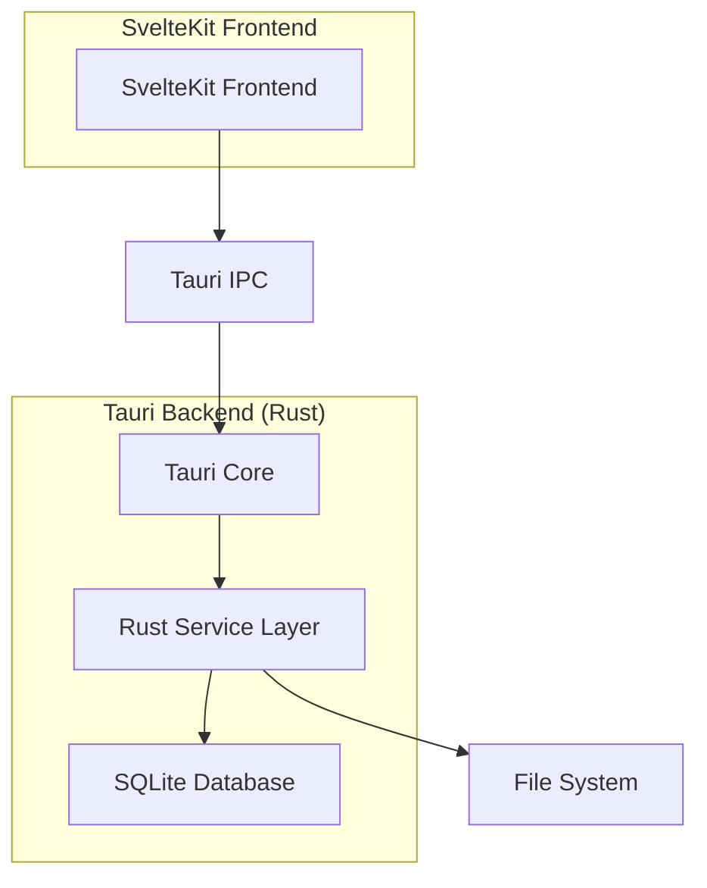
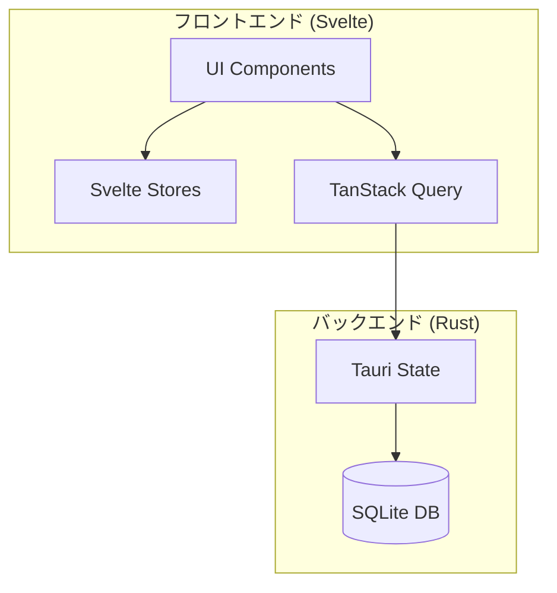

# 設計文書

## 概要

PC向け音楽管理アプリケーションは、SvelteKit + Tauriベースのデスクトップアプリケーションとして設計されます。フロントエンドにSvelteKit、バックエンドにRust（Tauri）、データベースにSQLiteを使用し、音楽ファイルの管理、再生、プレイリスト機能を提供します。

## アーキテクチャ

### 全体アーキテクチャ



### 技術スタック

- **フロントエンド**: SvelteKit + TypeScript
- **デスクトップフレームワーク**: Tauri
- **バックエンド**: Rust
- **データベース**: SQLite (rusqlite)
- **音楽メタデータ**: lofty (Rust crate)
- **音楽再生**: HTML5 Audio API + Tauri API
- **UI コンポーネント**: Tailwind CSS + DaisyUI
- **状態管理**: ハイブリッドアプローチ
  - **Svelte stores**: UI状態（再生中、音量、進行状況）
  - **Tauri State**: データ永続化（ライブラリ、プレイリスト）
  - **TanStack Query**: データフェッチとキャッシング

## コンポーネントとインターフェース

### フロントエンドコンポーネント（SvelteKit）

#### 1. App.svelte

- アプリケーションのルートコンポーネント
- レイアウトとグローバル状態管理

#### 2. Library.svelte

- 音楽ライブラリの表示
- 検索・フィルタリング機能
- グリッド/リスト表示の切り替え

#### 3. Player.svelte

- 音楽再生コントロール
- 進行バー、音量調整
- 現在再生中の楽曲情報表示

#### 4. Playlist.svelte

- プレイリスト一覧表示
- プレイリスト作成・編集
- ドラッグ&ドロップによる楽曲追加

#### 5. MetadataEditor.svelte

- 楽曲メタデータの編集フォーム
- 一括編集機能
- バリデーション機能

#### 6. ImportDialog.svelte

- フォルダ選択ダイアログ
- インポート進行状況表示
- 重複ファイル処理オプション

### Tauriコマンド（Rust）

#### 1. Music Library Commands

```rust
#[tauri::command]
async fn import_folder(folder_path: String) -> Result<ImportResult, String>

#[tauri::command]
async fn get_all_tracks() -> Result<Vec<Track>, String>

#[tauri::command]
async fn search_tracks(query: String) -> Result<Vec<Track>, String>

#[tauri::command]
async fn update_track_metadata(track_id: String, metadata: Metadata) -> Result<(), String>
```

#### 2. Playlist Commands

```rust
#[tauri::command]
async fn create_playlist(name: String) -> Result<Playlist, String>

#[tauri::command]
async fn get_playlists() -> Result<Vec<Playlist>, String>

#[tauri::command]
async fn add_track_to_playlist(playlist_id: String, track_id: String) -> Result<(), String>

#[tauri::command]
async fn remove_track_from_playlist(playlist_id: String, track_id: String) -> Result<(), String>

#[tauri::command]
async fn reorder_playlist_tracks(playlist_id: String, track_ids: Vec<String>) -> Result<(), String>
```

#### 3. Player Commands

```rust
#[tauri::command]
async fn get_track_file_path(track_id: String) -> Result<String, String>

#[tauri::command]
async fn get_current_track() -> Result<Option<Track>, String>
```

#### 4. Metadata Commands

```rust
#[tauri::command]
async fn extract_metadata(file_path: String) -> Result<Metadata, String>

#[tauri::command]
async fn update_file_metadata(file_path: String, metadata: Metadata) -> Result<(), String>

#[tauri::command]
async fn validate_metadata(metadata: Metadata) -> Result<ValidationResult, String>
```

## データモデル

### Track Model

```typescript
interface Track {
  id: string;
  filePath: string;
  fileName: string;
  title: string;
  artist: string;
  album: string;
  genre: string;
  year: number;
  duration: number;
  fileSize: number;
  format: string;
  bitrate: number;
  sampleRate: number;
  createdAt: Date;
  updatedAt: Date;
}
```

### Playlist Model

```typescript
interface Playlist {
  id: string;
  name: string;
  description?: string;
  tracks: PlaylistTrack[];
  createdAt: Date;
  updatedAt: Date;
}

interface PlaylistTrack {
  trackId: string;
  position: number;
  addedAt: Date;
}
```

### Metadata Model

```typescript
interface Metadata {
  title?: string;
  artist?: string;
  album?: string;
  genre?: string;
  year?: number;
  trackNumber?: number;
  albumArtist?: string;
  composer?: string;
}
```

### データベーススキーマ（SQLite with rusqlite）

```sql
-- Tracks table
CREATE TABLE tracks (
  id TEXT PRIMARY KEY,
  file_path TEXT UNIQUE NOT NULL,
  file_name TEXT NOT NULL,
  title TEXT,
  artist TEXT,
  album TEXT,
  genre TEXT,
  year INTEGER,
  duration INTEGER,
  file_size INTEGER,
  format TEXT,
  bitrate INTEGER,
  sample_rate INTEGER,
  created_at TEXT DEFAULT (datetime('now')),
  updated_at TEXT DEFAULT (datetime('now'))
);

-- Playlists table
CREATE TABLE playlists (
  id TEXT PRIMARY KEY,
  name TEXT NOT NULL,
  description TEXT,
  created_at TEXT DEFAULT (datetime('now')),
  updated_at TEXT DEFAULT (datetime('now'))
);

-- Playlist tracks junction table
CREATE TABLE playlist_tracks (
  playlist_id TEXT,
  track_id TEXT,
  position INTEGER,
  added_at TEXT DEFAULT (datetime('now')),
  PRIMARY KEY (playlist_id, track_id),
  FOREIGN KEY (playlist_id) REFERENCES playlists(id) ON DELETE CASCADE,
  FOREIGN KEY (track_id) REFERENCES tracks(id) ON DELETE CASCADE
);

-- Indexes for performance
CREATE INDEX idx_tracks_artist ON tracks(artist);
CREATE INDEX idx_tracks_album ON tracks(album);
CREATE INDEX idx_tracks_genre ON tracks(genre);
CREATE INDEX idx_tracks_title ON tracks(title);
CREATE INDEX idx_playlist_tracks_playlist_id ON playlist_tracks(playlist_id);
```

### Rust構造体定義

```rust
use serde::{Deserialize, Serialize};

#[derive(Debug, Serialize, Deserialize, Clone)]
pub struct Track {
    pub id: String,
    pub file_path: String,
    pub file_name: String,
    pub title: Option<String>,
    pub artist: Option<String>,
    pub album: Option<String>,
    pub genre: Option<String>,
    pub year: Option<i32>,
    pub duration: Option<i32>,
    pub file_size: i64,
    pub format: String,
    pub bitrate: Option<i32>,
    pub sample_rate: Option<i32>,
    pub created_at: String,
    pub updated_at: String,
}

#[derive(Debug, Serialize, Deserialize, Clone)]
pub struct Playlist {
    pub id: String,
    pub name: String,
    pub description: Option<String>,
    pub tracks: Vec<PlaylistTrack>,
    pub created_at: String,
    pub updated_at: String,
}

#[derive(Debug, Serialize, Deserialize, Clone)]
pub struct PlaylistTrack {
    pub track_id: String,
    pub position: i32,
    pub added_at: String,
}

#[derive(Debug, Serialize, Deserialize, Clone)]
pub struct Metadata {
    pub title: Option<String>,
    pub artist: Option<String>,
    pub album: Option<String>,
    pub genre: Option<String>,
    pub year: Option<i32>,
    pub track_number: Option<i32>,
    pub album_artist: Option<String>,
    pub composer: Option<String>,
}
```

## エラーハンドリング

### エラータイプ

1. **FileNotFoundError**: 音楽ファイルが見つからない場合
2. **UnsupportedFormatError**: サポートされていないファイル形式
3. **MetadataExtractionError**: メタデータ抽出に失敗した場合
4. **DatabaseError**: データベース操作エラー
5. **PlaybackError**: 音楽再生エラー
6. **ValidationError**: データバリデーションエラー

### エラーハンドリング戦略

- **グローバルエラーハンドラー**: 未処理のエラーをキャッチしてログ出力
- **ユーザーフレンドリーなエラーメッセージ**: 技術的詳細を隠した分かりやすいメッセージ
- **エラーリカバリー**: 可能な場合は自動復旧を試行
- **ログ記録**: すべてのエラーをファイルに記録
- **フォールバック機能**: 重要な機能が失敗した場合の代替手段

## テスト戦略

### テストレベル

1. **ユニットテスト**
   - サービス層の各メソッド
   - データモデルのバリデーション
   - ユーティリティ関数

2. **統合テスト**
   - データベース操作
   - ファイルシステム操作
   - メタデータ抽出

3. **E2Eテスト**
   - 音楽インポートフロー
   - プレイリスト作成・編集
   - 音楽再生機能

### テストツール

- **Rustユニットテスト**: cargo test + tokio-test
- **フロントエンドテスト**: Vitest + @testing-library/svelte
- **E2Eテスト**: Playwright + Tauri
- **モック**: mockall (Rust) + vi.mock (Vitest)
- **テストデータ**: サンプル音楽ファイルとメタデータ

### テストカバレッジ目標

- **Rustサービス層**: 90%以上
- **Svelteコンポーネント**: 80%以上
- **全体**: 85%以上

### Tauri固有の考慮事項

#### セキュリティ設定

```json
{
  "tauri": {
    "allowlist": {
      "fs": {
        "all": false,
        "readFile": true,
        "writeFile": true,
        "readDir": true,
        "scope": ["$AUDIO", "$DATA"]
      },
      "dialog": {
        "all": false,
        "open": true
      },
      "path": {
        "all": true
      }
    }
  }
}
```

#### ファイルシステムアクセス

- Tauriのスコープ機能を使用してセキュアなファイルアクセス
- ユーザーが選択したディレクトリのみアクセス許可
- 音楽ファイル専用のスコープ設定

## パフォーマンス考慮事項

### 最適化戦略

1. **大量ファイル処理**
   - バッチ処理によるインポート
   - プログレスバーでの進行状況表示
   - バックグラウンド処理

2. **検索パフォーマンス**
   - データベースインデックス
   - 検索結果のページネーション
   - デバウンス処理

3. **メモリ管理**
   - 大きなプレイリストの仮想化
   - 音楽ファイルのストリーミング再生
   - 不要なデータのガベージコレクション

4. **UI応答性**
   - 非同期処理
   - ローディング状態の表示
   - 操作のキャンセル機能

## セキュリティ考慮事項

1. **ファイルアクセス制御**
   - ユーザーが選択したフォルダのみアクセス
   - パストラバーサル攻撃の防止

2. **データ検証**
   - 入力データのサニタイゼーション
   - SQLインジェクション対策

3. **プライバシー**
   - ローカルデータのみ使用
   - 外部サーバーへのデータ送信なし

## 状態管理の詳細設計

### ハイブリッド状態管理アーキテクチャ



### 1. Svelte Stores（UI状態管理）

リアルタイムで変化するUI状態を管理

```typescript
// src/lib/stores/player.ts
import { writable, derived } from 'svelte/store';

// 再生状態
export const isPlaying = writable(false);
export const currentTime = writable(0);
export const duration = writable(0);
export const volume = writable(1.0);

// 進行状況（派生store）
export const progress = derived([currentTime, duration], ([$currentTime, $duration]) =>
  $duration > 0 ? ($currentTime / $duration) * 100 : 0
);

// UI表示状態
export const viewMode = writable<'grid' | 'list'>('grid');
export const selectedTracks = writable<string[]>([]);
```

**使用ケース:**

- 音楽再生の状態（再生中/一時停止）
- 再生位置と進行状況
- 音量レベル
- UI表示モード（グリッド/リスト）
- 選択中のトラック

### 2. Tauri State（永続データ管理）

Rust側で管理する永続化が必要なデータ

```rust
// src-tauri/src/state.rs
use std::sync::Mutex;
use tauri::State;

pub struct AppState {
    pub db: Mutex<rusqlite::Connection>,
    pub current_track_id: Mutex<Option<String>>,
}

#[tauri::command]
async fn get_library_stats(state: State<'_, AppState>) -> Result<LibraryStats, String> {
    let db = state.db.lock().unwrap();
    // データベースから統計情報を取得
    Ok(LibraryStats { /* ... */ })
}
```

**使用ケース:**

- データベース接続
- 現在再生中のトラックID
- アプリケーション設定
- インポート進行状況

### 3. TanStack Query（データフェッチとキャッシング）

サーバー状態（Tauriバックエンド）のキャッシングと同期

```typescript
// src/lib/queries/tracks.ts
import { createQuery } from '@tanstack/svelte-query';
import { invoke } from '@tauri-apps/api/core';

export function useTracksQuery() {
  return createQuery({
    queryKey: ['tracks'],
    queryFn: async () => {
      return await invoke<Track[]>('get_all_tracks');
    },
    staleTime: 5 * 60 * 1000 // 5分間キャッシュ
  });
}

export function useSearchQuery(searchTerm: string) {
  return createQuery({
    queryKey: ['tracks', 'search', searchTerm],
    queryFn: async () => {
      return await invoke<Track[]>('search_tracks', { query: searchTerm });
    },
    enabled: searchTerm.length > 0
  });
}

export function usePlaylistsQuery() {
  return createQuery({
    queryKey: ['playlists'],
    queryFn: async () => {
      return await invoke<Playlist[]>('get_playlists');
    }
  });
}
```

**使用ケース:**

- 音楽ライブラリデータの取得とキャッシング
- 検索結果のキャッシング
- プレイリスト一覧の取得
- 自動再取得とバックグラウンド更新

### 状態管理の使い分け

| 状態の種類                  | 管理方法       | 理由                   |
| --------------------------- | -------------- | ---------------------- |
| 再生状態（再生中/一時停止） | Svelte Stores  | リアルタイム更新が必要 |
| 再生位置・音量              | Svelte Stores  | 頻繁に変更される       |
| UI表示モード                | Svelte Stores  | ローカルUI状態         |
| 音楽ライブラリデータ        | TanStack Query | キャッシングが有効     |
| 検索結果                    | TanStack Query | 重複リクエスト防止     |
| プレイリスト                | TanStack Query | 自動再取得が有効       |
| データベース接続            | Tauri State    | バックエンドリソース   |
| アプリ設定                  | Tauri State    | 永続化が必要           |

### データフロー例

#### 音楽再生フロー

```
1. ユーザーがトラックをクリック
2. TanStack Queryがキャッシュからトラック情報を取得
3. Tauri commandでファイルパスを取得
4. HTML5 Audioで再生開始
5. Svelte Storesで再生状態を更新
6. UIがリアクティブに更新
```

#### 検索フロー

```
1. ユーザーが検索ワードを入力
2. デバウンス処理（300ms）
3. TanStack Queryが検索を実行
4. キャッシュがあれば即座に表示
5. なければTauri commandで検索
6. 結果をキャッシュして表示
```
