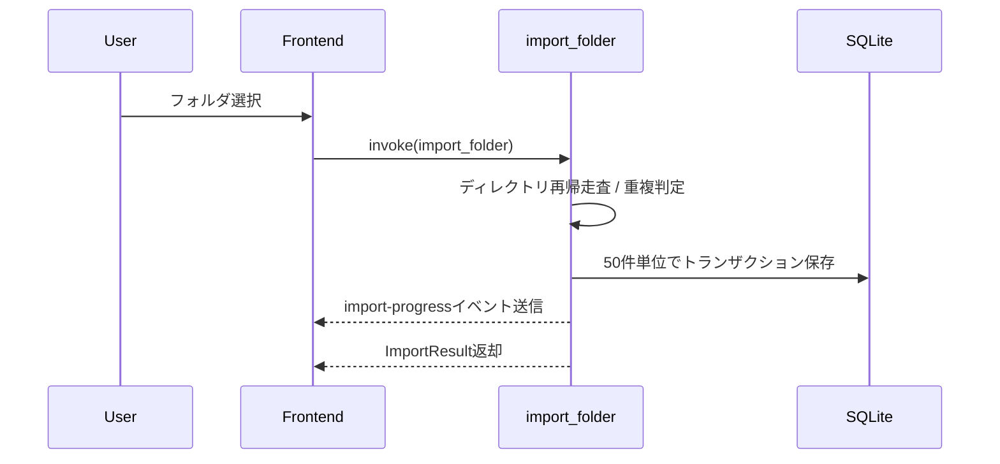

# 設計概要: アーキテクチャ・データフロー

## 全体アーキテクチャ

```mermaid
graph TD
    U[User] --> FE[SvelteKit UI]
    FE --> STORES[Svelte Stores]
    FE --> QUERY[TanStack Query]
    QUERY --> INVOKE[@tauri-apps/api/core invoke]
    INVOKE --> CMD[Rust Commands]
    CMD --> REPO[repository / playlist / library / metadata]
    REPO --> DB[(SQLite + FTS5)]
    REPO --> FS[(ローカル音楽ファイル)]
    CMD --> EVT[Tauri Event Emitter]
    EVT --> FE
```

## レイヤー責務

| レイヤー                  | 主な実装                                                    | 責務                                               |
| ------------------------- | ----------------------------------------------------------- | -------------------------------------------------- |
| UI                        | `src/routes`, `src/lib/components`                          | 画面描画、ユーザー操作の受付                       |
| クライアント状態          | `src/lib/stores`                                            | 再生状態・UI状態など即時反映が必要な状態管理       |
| サーバー状態キャッシュ    | `src/lib/queries`                                           | `invoke`呼び出し、キャッシュ、再取得制御           |
| コマンド層                | `src-tauri/src/commands/*`                                  | 入力バリデーション、ユースケース単位の操作公開     |
| ドメイン/データアクセス層 | `repository.rs`, `library.rs`, `playlist.rs`, `metadata.rs` | SQL実行、ファイル走査、タグ読み書き                |
| 永続化                    | SQLite, ローカルファイル                                    | トラック/プレイリスト/統計の保存、音楽ファイル実体 |

## フロントエンド構成

- ルート: `src/routes/(app)` 配下にライブラリ・プレイリスト、`src/routes/settings` に設定画面
- UI部品: `src/lib/components` と `src/lib/components/ui`
- 型: `src/lib/types/models.ts` をRustモデルと対応させる
- データ取得: `src/lib/queries/*.ts` で `invoke()` をラップ

## バックエンド構成

- エントリーポイント: `src-tauri/src/lib.rs`
- アプリ状態: `AppState { db: Mutex<Connection>, current_track_id: Mutex<Option<String>> }`
- コマンド登録: `tauri::generate_handler!` でインポート/検索/編集/再生/統計/システム操作を公開
- DB初期化: `db.rs` のマイグレーションでテーブル・インデックス・FTS5・トリガーを作成

## 主要データフロー

### インポート



### 検索

1. フロントエンドで300msデバウンス
2. `search_tracks` 実行
3. バックエンドはFTS5 `MATCH` を優先し、失敗時は `LIKE` にフォールバック
4. 結果をTanStack QueryでキャッシュしてUIへ反映

### メタデータ編集

1. 入力値バリデーション（ID形式、文字数、年・トラック番号）
2. `update_track_metadata`（DBのみ）または`update_track_metadata_with_file`（DB+ファイル）を実行
3. 成功後に関連クエリをinvalidateして一覧表示を同期
