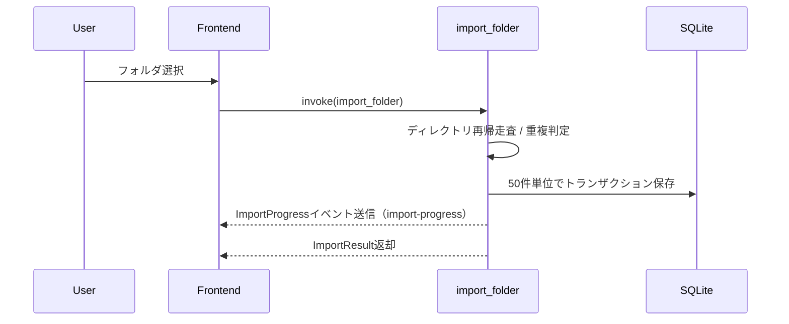
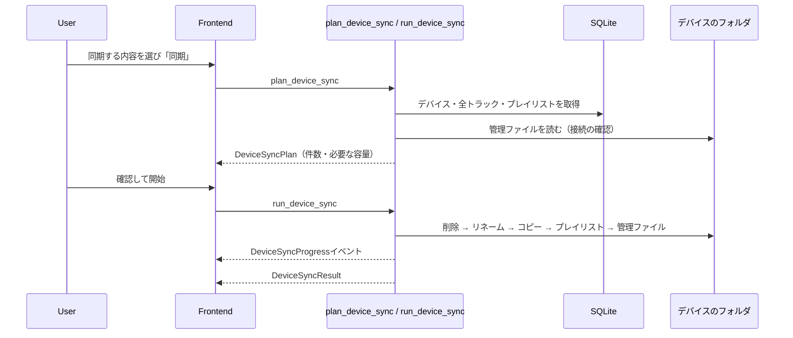

# 設計概要: アーキテクチャ・データフロー

## 全体アーキテクチャ

```mermaid
graph TD
    U[User] --> FE[SvelteKit UI]
    FE --> STORES[共有状態 stores]
    FE --> QUERY[TanStack Query]
    QUERY --> INVOKE[@tauri-apps/api/core invoke]
    INVOKE --> CMD[Rust Commands]
    CMD --> REPO[repository / playlist / library / metadata]
    REPO --> DB[(SQLite + FTS5)]
    REPO --> FS[(ローカル音楽ファイル)]
    CMD --> EVT[Tauri Event Emitter]
    EVT --> FE
```

## レイヤー責務

| レイヤー                  | 主な実装                                                    | 責務                                               |
| ------------------------- | ----------------------------------------------------------- | -------------------------------------------------- |
| UI                        | `src/routes`, `src/lib/components`                          | 画面描画、ユーザー操作の受付                       |
| クライアント状態          | `src/lib/stores`                                            | 再生状態・UI状態など即時反映が必要な状態管理       |
| サーバー状態キャッシュ    | `src/lib/queries`                                           | `invoke`呼び出し、キャッシュ、再取得制御           |
| コマンド層                | `src-tauri/src/commands/*`                                  | 入力バリデーション、ユースケース単位の操作公開     |
| ドメイン/データアクセス層 | `repository.rs`, `library.rs`, `playlist.rs`, `metadata.rs` | SQL実行、ファイル走査、タグ読み書き                |
| 永続化                    | SQLite, ローカルファイル                                    | トラック/プレイリスト/統計の保存、音楽ファイル実体 |

## フロントエンド構成

- ルート: `src/routes/(app)` 配下にライブラリ・プレイリスト・転送先デバイス（`devices/[id]`）、`src/routes/settings` に設定画面（メニューから開く別ウィンドウ。独自のQueryClientを持つ）
- 設定: Rust側（`settings.rs`）がアプリデータ配下の`settings.json`に保存する。設定ウィンドウで保存するとRustが`SettingsChanged`イベントを送り、メインウィンドウの`SettingsSync`がキャッシュ・テーマ・アクセントカラー（CSS変数`--color-primary`）を更新する
- 多言語化: 画面の文言は`src/lib/i18n/messages`（日本語・英語）に定義し、`#lib/i18n/i18n.svelte`の`m`から読む。言語は`$state`のため、切り替えるとコンポーネントを作り直さずに文言が変わる（再生は止まらない）。メニューバーと設定ウィンドウのタイトルはRust側（`menu.rs`）が言語に合わせて作り直す
- テーマ: `#lib/utils/theme`の`applyTheme`が`<html data-theme>`に`dark`・`light`を設定し、`app.css`の配色（とDaisyUIのテーマ）を切り替える。「OSの設定に従う」の間は`prefers-color-scheme`の変化に追従する。設定を読み込むまでの間は、前回のテーマ（`localStorage`）を`restoreTheme`で反映する
- 起動時の画面: ルート（`/`）が設定に応じて、前回開いていた画面（`localStorage`に記録）か曲一覧へ移動する
- UI部品: `src/lib/components` と `src/lib/components/ui`
- 型: `src/lib/types/models.ts` をRustモデルと対応させる
- データ取得: `src/lib/queries/*.ts` のクエリ・ミューテーションがコマンド呼び出し・キャッシュ無効化・エラー通知を担い、コンポーネントからは直接コマンドを呼ばない
- アルバムアート: `#lib/utils/albumArt` の `albumArtUrl(trackId)` が返す `albumart://` のURLを `` に指定し、Rust側のカスタムプロトコルから直接読み込む（フロントエンドに画像データを保持しない）
- 再生: `src/lib/stores/playback.svelte.ts` の再生コントローラーがaudio要素と再生状態（`player.svelte.ts` の `player`）を `$effect` で同期し、`Player.svelte` は表示と操作の受付に専念する
- 音声の経路: audio要素（デッキ。2つ） → デッキごとの音量の正規化（GainNode、ReplayGainから求めた倍率） → デッキごとのフェード（GainNode、クロスフェード） → イコライザ（10バンドのBiquadFilterNode、共通） → 全体ゲイン → 出力。Web Audioのグラフは`equalizer.svelte.ts`が作る
- ギャップレス再生・クロスフェード: 再生コントローラーが、再生中ではない方のデッキに次の曲を先読みし、曲の終わりの直前（クロスフェードでは設定した秒数前）に再生を始めて切り替える（`Player.svelte`がaudio要素を2つ置く）
- ダイアログ: `src/lib/components/ui/Modal.svelte`（ネイティブの`<dialog>`）に統一。テキスト入力は`promptText()`の要求を、レイアウトに置いた`TextPromptDialog`が表示する
- ブラウザ確認用モック: `npm run dev:mock` のときだけ `src/hooks.client.ts` が `src/lib/mocks` のインメモリバックエンドへIPCを差し替える（`implementation.md` 参照）

## バックエンド構成

- エントリーポイント: `src-tauri/src/lib.rs`
- アプリ状態: `AppState { db: Mutex<Connection>, current_track_id: Mutex<Option<String>>, album_art_limiter: Semaphore, album_art_cache: Mutex<AlbumArtCache>, library_scan_lock: Mutex<()> }`。ほかに設定（`SettingsState`）とライブラリフォルダの自動反映（`LibrarySync`）を管理する
- ライブラリフォルダの自動反映: `library_sync.rs` が、設定に応じて起動時・定期（専用スレッド）・フォルダの監視（`notify-debouncer-mini`）で再スキャンする。インポート・再スキャン・ライブラリフォルダの削除は`library_scan_lock`で1つずつ行い、ロックの順序は「スキャン → DB」
- アルバムアートの配信: `album_art.rs` が `albumart` カスタムプロトコルを処理する。トラックIDからDB上のファイルを引いて埋め込み画像をバイト列のまま返し、抽出結果（アートがないことを含む）は容量上限付きのLRUキャッシュ（64MiB）に保持する。WebViewには`no-store`でキャッシュさせず、インポート後はキャッシュを消去する
- 重い同期処理（インポート、メタデータ再読込、ファイルへのタグ書き込み、アルバムアート抽出、ファイル削除）は `run_blocking`（`spawn_blocking`）でブロッキング処理用スレッドへ逃がし、非同期ランタイムのワーカーを占有しない。アルバムアート抽出はセマフォで同時実行数を4に制限する
- バックエンド→フロントエンドの通知は `events.rs` の型付きイベント（tauri-specta）で行い、フロントは `bindings.ts` の `events.xxx.listen()` で受け取る
- デバイスへの転送: `device.rs`（デバイスの記録）・`device_manifest.rs`（デバイス側の管理ファイル）・`device_sync.rs`（配置と差分の計算。ファイルシステムに触れない）・`device_transfer.rs`（削除・リネーム・コピー・プレイリストの書き出し）に分ける。同時に実行する同期は1つ（`DeviceSyncState`）で、DBロックは曲・プレイリストの読み出しの間だけ持つ（コピー中は持たない）
- コマンド登録: `tauri::generate_handler!` でインポート/検索/編集/再生/統計/システム操作を公開
- DB初期化: `db.rs` のマイグレーションでテーブル・インデックス・FTS5・トリガーを作成

## 主要データフロー

### インポート

```mermaid
sequenceDiagram
    participant User
    participant Frontend
    participant TauriCmd as import_folder
    participant DB as SQLite

    User->>Frontend: フォルダ選択
    Frontend->>TauriCmd: invoke(import_folder)
    TauriCmd->>TauriCmd: ディレクトリ再帰走査 / 重複判定
    TauriCmd->>DB: 50件単位でトランザクション保存
    TauriCmd-->>Frontend: ImportProgressイベント送信（import-progress）
    TauriCmd-->>Frontend: ImportResult返却
```

インポートしたフォルダは `library_folders` に記録する（ライブラリフォルダ）。

### ライブラリフォルダの再スキャン

1. 設定ウィンドウの「ライブラリ」で再スキャンを実行する（`rescan_library_folder`）
2. フォルダを走査し、ライブラリのトラックとサイズ・更新日時を比べる（`library_folder::plan_rescan`）
   - ライブラリにないファイルは追加、サイズか更新日時が変わったファイルは読み直す（変わっていないファイルは読まないため、DBだけで編集したメタデータは保たれる）
   - 見つからなくなったファイルの曲はライブラリから外す。ただしフォルダ自体が見つからない、または音楽ファイルが1件も見つからない場合は外さない
3. 読み込みはインポートと同じく、DBロックの外でメタデータを抽出し、50件単位で書き込む（`LibraryScanProgress`イベントで進捗を送る）
4. 曲が変わったら`LibraryChanged`イベントを送り、メインウィンドウ（`(app)/+layout.svelte`）がトラック一覧とプレイリストのキャッシュを無効化する

### デバイスへの転送

```mermaid
sequenceDiagram
    participant User
    participant Frontend
    participant Cmd as plan_device_sync / run_device_sync
    participant DB as SQLite
    participant Device as デバイスのフォルダ

    User->>Frontend: 同期する内容を選び「同期」
    Frontend->>Cmd: plan_device_sync
    Cmd->>DB: デバイス・全トラック・プレイリストを取得
    Cmd->>Device: 管理ファイルを読む（接続の確認）
    Cmd-->>Frontend: DeviceSyncPlan（件数・必要な容量）
    User->>Frontend: 確認して開始
    Frontend->>Cmd: run_device_sync
    Cmd->>Device: 削除 → リネーム → コピー → プレイリスト → 管理ファイル
    Cmd-->>Frontend: DeviceSyncProgressイベント
    Cmd-->>Frontend: DeviceSyncResult
```

1. サイドバーの「デバイス」でフォルダを選んで登録する（`register_sync_device`）。フォルダに管理ファイル（`.muspice/manifest.json`）を書く
2. デバイスのページ（`(app)/devices/[id]`）で同期する内容（全曲・プレイリスト）を選ぶ。変更はすぐに保存する（`update_sync_device`）。接続の状態は、ページを開いている間は5秒ごとに、それ以外はウィンドウに戻ったときに読み直す
3. 「同期」で差分を調べて（`plan_device_sync`）確認のダイアログ（`DeviceSyncDialog`）に表示し、確認の後に同期する（`run_device_sync`）
4. 差分は、同期する曲・プレイリストと管理ファイルを比べて決める（`device_sync::plan_sync`）。詳細は`detailed-design.md`

### 検索

1. フロントエンドで300msデバウンス
2. `search_tracks` 実行
3. バックエンドはFTS5 `MATCH` を優先し、失敗時は `LIKE` にフォールバック
4. 結果をTanStack QueryでキャッシュしてUIへ反映

### メタデータ編集

1. 入力値バリデーション（ID形式、文字数、年・トラック番号）
2. `update_track_metadata`（DBのみ）または`update_track_metadata_with_file`（DB+ファイル）を実行
3. 成功後に関連クエリをinvalidateして一覧表示を同期
