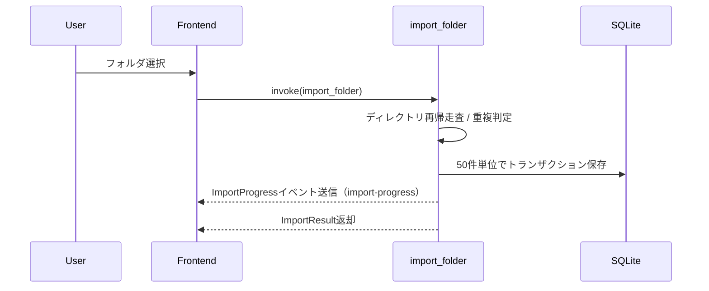
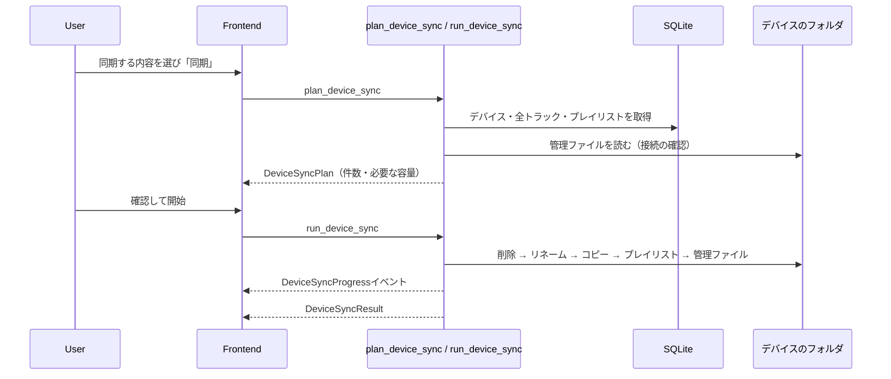

# 設計概要: アーキテクチャ・データフロー

## 全体アーキテクチャ

```mermaid
graph TD
    U[User] --> FE[SvelteKit UI]
    FE --> STORES[共有状態 stores]
    FE --> QUERY[TanStack Query]
    QUERY --> INVOKE[@tauri-apps/api/core invoke]
    INVOKE --> CMD[Rust Commands]
    CMD --> REPO[repository / playlist / library / metadata]
    REPO --> DB[(SQLite + FTS5)]
    REPO --> FS[(ローカル音楽ファイル)]
    CMD --> EVT[Tauri Event Emitter]
    EVT --> FE
```

## レイヤー責務

| レイヤー                  | 主な実装                                                    | 責務                                               |
| ------------------------- | ----------------------------------------------------------- | -------------------------------------------------- |
| UI                        | `src/routes`, `src/lib/components`                          | 画面描画、ユーザー操作の受付                       |
| クライアント状態          | `src/lib/stores`                                            | 再生状態・UI状態など即時反映が必要な状態管理       |
| サーバー状態キャッシュ    | `src/lib/queries`                                           | `invoke`呼び出し、キャッシュ、再取得制御           |
| コマンド層                | `src-tauri/src/commands/*`                                  | 入力バリデーション、ユースケース単位の操作公開     |
| ドメイン/データアクセス層 | `repository.rs`, `library.rs`, `playlist.rs`, `metadata.rs` | SQL実行、ファイル走査、タグ読み書き                |
| 永続化                    | SQLite, ローカルファイル                                    | トラック/プレイリスト/統計の保存、音楽ファイル実体 |

## フロントエンド構成

- ルート: `src/routes/(app)` 配下にライブラリ・プレイリスト・転送先デバイス（`devices/[id]`）、`src/routes/settings` に設定画面（メニューから開く別ウィンドウ。独自のQueryClientを持つ）
- 設定: Rust側（`settings.rs`）がアプリデータ配下の`settings.json`に保存する。設定ウィンドウで保存するとRustが`SettingsChanged`イベントを送り、メインウィンドウの`SettingsSync`がキャッシュ・テーマ・アクセントカラー（CSS変数`--color-primary`）を更新する
- ウィンドウの状態: メインウィンドウのサイズ・位置・最大化・フルスクリーンは、`tauri-plugin-window-state`が終了時にアプリの設定フォルダの`.window-state.json`へ保存し、次回の起動時に復元する（`lib.rs`の`window_state_plugin()`）。記憶がない初回は`tauri.conf.json`の大きさ（1280×800）で開く。設定ウィンドウは対象外で、毎回同じ大きさで開く
- 多言語化: 画面の文言は`src/lib/i18n/messages`（日本語・英語）に定義し、`#lib/i18n/i18n.svelte`の`m`から読む。言語は`$state`のため、切り替えるとコンポーネントを作り直さずに文言が変わる（再生は止まらない）。メニューバーと設定ウィンドウのタイトルはRust側（`menu.rs`）が言語に合わせて作り直す
- テーマ: `#lib/utils/theme`の`applyTheme`が`<html data-theme>`に`dark`・`light`を設定し、`app.css`の配色（とDaisyUIのテーマ）を切り替える。「OSの設定に従う」の間は`prefers-color-scheme`の変化に追従する。設定を読み込むまでの間は、前回のテーマ（`localStorage`）を`restoreTheme`で反映する
- 起動時の画面: ルート（`/`）が設定に応じて、前回開いていた画面（`localStorage`に記録）か曲一覧へ移動する
- UI部品: `src/lib/components` と `src/lib/components/ui`
- 型: `src/lib/types/models.ts` をRustモデルと対応させる
- データ取得: `src/lib/queries/*.ts` のクエリ・ミューテーションがコマンド呼び出し・キャッシュ無効化・エラー通知を担い、コンポーネントからは直接コマンドを呼ばない
- 曲の一覧: 全曲の一覧は件数の上限なく1回で取得してキャッシュし、並び替え・選択・再生キューの作成はフロントで行う。アルバム・アーティストはアルバムアーティスト（なければ曲のアーティスト）でまとめる（ADR-022）。アルバム・アーティスト・ジャンルは一覧（曲数・代表の曲）だけを取得し、曲は詳細を開いた時・再生する時にその分だけ取得する。プレイリストの曲も、プレイリストごとに取得する（ADR-021）
- 長い一覧の描画: `src/lib/components/ui/VirtualList.svelte` が、見えている行（とその前後の少しの行）だけを描画する（`implementation.md` 参照）
- アルバムアート: `#lib/utils/albumArt` の `albumArtUrl(trackId)` が返す `albumart://` のURLを `` に指定し、Rust側のカスタムプロトコルから直接読み込む（フロントエンドに画像データを保持しない）
- 再生: 再生コントローラー（`src/lib/stores/playback.svelte.ts`）が、再生状態（`player.svelte.ts` の `player`）を `$effect` で監視してRust側の再生エンジン（`src-tauri/src/playback/`）をコマンドで操作し、エンジンからの通知（`PlaybackEvent`。再生位置・曲の切り替わり・終了）を再生状態へ反映する。`Player.svelte` は表示と操作の受付に専念する
  - 再生キュー（次の曲の決定・シャッフル・リピート）は、フロントエンド（`player.svelte.ts`）が持つ。エンジンへは「再生する曲」と「続けて再生する曲」だけを伝える（ADR-025）
  - イコライザ・音量の正規化・クロスフェードは、エンジンの中でかける（ADR-026）。イコライザの設定はフロントエンドが保存し（`equalizer.svelte.ts`。localStorage）、再生コントローラーがエンジンへ送る
  - WebViewは音声ファイルを読まない（audio要素・Web Audioは使わない。ADR-027）
  - 再生状態の保存と復元: 音量・シャッフル・リピート・再生キュー・再生していた曲を、Rust側（`playback_state.rs`）がアプリデータ配下の`playback-state.json`に保存する。再生コントローラーが、起動時に復元し（再生は始めない）、その後の変更をまとめて保存する（`playbackState.svelte.ts`。ADR-028）
- ダイアログ: `src/lib/components/ui/Modal.svelte`（ネイティブの`<dialog>`）に統一。テキスト入力は`promptText()`の要求を、レイアウトに置いた`TextPromptDialog`が表示する
- ブラウザ確認用モック: `npm run dev:mock` のときだけ `src/hooks.client.ts` が `src/lib/mocks` のインメモリバックエンドへIPCを差し替える（`implementation.md` 参照）

## バックエンド構成

- エントリーポイント: `src-tauri/src/lib.rs`
- アプリ状態: `AppState { db: Mutex<Connection>, current_track_id: Mutex<Option<String>>, album_art_limiter: Semaphore, album_art_cache: Mutex<AlbumArtCache>, library_scan_lock: Mutex<()> }`。ほかに設定（`SettingsState`）・前回の再生状態（`PlaybackStateStore`）・再生エンジン（`PlaybackEngine`）・ライブラリフォルダの自動反映（`LibrarySync`）を管理する
- 既存のトラックのアルバムアーティストの読み込み: `album_artist_backfill.rs` が、アルバムアーティストの列を追加する前に登録したトラックの分を、起動時に別スレッドでファイルのタグから読み込む（対象がなければ何もしない。ADR-022）
- ライブラリフォルダの自動反映: `library_sync.rs` が、設定に応じて起動時・定期（専用スレッド）・フォルダの監視（`notify-debouncer-mini`）で再スキャンする。インポート・再スキャン・ライブラリフォルダの削除は`library_scan_lock`で1つずつ行い、ロックの順序は「スキャン → DB」
- アルバムアートの配信: `album_art.rs` が `albumart` カスタムプロトコルを処理する。トラックIDからDB上のファイルを引いて埋め込み画像をバイト列のまま返し、抽出結果（アートがないことを含む）は容量上限付きのLRUキャッシュ（64MiB）に保持する。WebViewには`no-store`でキャッシュさせず、インポート後はキャッシュを消去する
- 重い同期処理（インポート、メタデータ再読込、ファイルへのタグ書き込み、アルバムアート抽出、ファイル削除）は `run_blocking`（`spawn_blocking`）でブロッキング処理用スレッドへ逃がし、非同期ランタイムのワーカーを占有しない。アルバムアート抽出はセマフォで同時実行数を4に制限する
- バックエンド→フロントエンドの通知は `events.rs` の型付きイベント（tauri-specta）で行い、フロントは `bindings.ts` の `events.xxx.listen()` で受け取る
- デバイスへの転送: `device.rs`（デバイスの記録）・`device_manifest.rs`（デバイス側の管理ファイル）・`device_sync.rs`（配置と差分の計算。ファイルシステムに触れない）・`device_transfer.rs`（削除・リネーム・コピー・プレイリストの書き出し）に分ける。同時に実行する同期は1つ（`DeviceSyncState`）で、DBロックは曲・プレイリストの読み出しの間だけ持つ（コピー中は持たない）
- 再生エンジン: `playback/`。エンジンのスレッド（`engine.rs`）がコマンドを順に処理しながら、デコード（`decoder.rs`。`symphonia`とlibopus） → 出力の形式への変換（`convert.rs`。ステレオ・出力デバイスのサンプルレート。`rubato`） → 音量の正規化（`normalization.rs`。曲ごとの倍率） → クロスフェード（2曲を重ねる） → リングバッファへの書き込みを行う。出力のコールバック（`render.rs`。`cpal`が呼ぶOSの音声のスレッド）は、リングバッファから取り出して、イコライザ → 音量・一時停止 → リミッター（`effects.rs`）の順にかけるだけで、ロック・メモリの確保・ファイルの読み取りをしない。出力は最初に再生する時に開き、再生していない間は止める（ADR-025・ADR-026）
- コマンド登録: `tauri::generate_handler!` でインポート/検索/編集/再生/統計/システム操作を公開
- DB初期化: `db.rs` のマイグレーションでテーブル・インデックス・FTS5・トリガーを作成

## 主要データフロー

### インポート

```mermaid
sequenceDiagram
    participant User
    participant Frontend
    participant TauriCmd as import_folder
    participant DB as SQLite

    User->>Frontend: フォルダ選択
    Frontend->>TauriCmd: invoke(import_folder)
    TauriCmd->>TauriCmd: ディレクトリ再帰走査 / 重複判定
    TauriCmd->>DB: 50件単位でトランザクション保存
    TauriCmd-->>Frontend: ImportProgressイベント送信（import-progress）
    TauriCmd-->>Frontend: ImportResult返却
```

インポートしたフォルダは `library_folders` に記録する（ライブラリフォルダ）。

### ライブラリフォルダの再スキャン

1. 設定ウィンドウの「ライブラリ」で再スキャンを実行する（`rescan_library_folder`）
2. フォルダを走査し、ライブラリのトラックとサイズ・更新日時を比べる（`library_folder::plan_rescan`）
   - ライブラリにないファイルは追加、サイズか更新日時が変わったファイルは読み直す（変わっていないファイルは読まない。アプリからの編集は、書き込み後のサイズ・更新日時を記録するため変更とみなさない）
   - 見つからなくなったファイルの曲は、外さずに「見つからない曲」として残す（お気に入り・再生回数・プレイリストを保つ）。ただしフォルダ自体が見つからない、または音楽ファイルが1件も見つからない場合は、見つからない曲にもしない
3. 読み込みはインポートと同じく、DBロックの外でメタデータを抽出し、50件単位で書き込む（`LibraryScanProgress`イベントで進捗を送る）
   - ライブラリにないファイルが、見つからない曲の移動・改名の先と判定できた場合（`track_relink`）は、新しい曲として追加せず、その曲のパスを付け替える（ADR-023）
4. 曲が変わったら`LibraryChanged`イベントを送り、メインウィンドウ（`(app)/+layout.svelte`）がトラック一覧とプレイリストのキャッシュを無効化する

### デバイスへの転送

```mermaid
sequenceDiagram
    participant User
    participant Frontend
    participant Cmd as plan_device_sync / run_device_sync
    participant DB as SQLite
    participant Device as デバイスのフォルダ

    User->>Frontend: 同期する内容を選び「同期」
    Frontend->>Cmd: plan_device_sync
    Cmd->>DB: デバイス・全トラック・プレイリストを取得
    Cmd->>Device: 管理ファイルを読む（接続の確認）
    Cmd-->>Frontend: DeviceSyncPlan（件数・必要な容量）
    User->>Frontend: 確認して開始
    Frontend->>Cmd: run_device_sync
    Cmd->>Device: 削除 → リネーム → コピー → プレイリスト → 管理ファイル
    Cmd-->>Frontend: DeviceSyncProgressイベント
    Cmd-->>Frontend: DeviceSyncResult
```

1. サイドバーの「デバイス」でフォルダを選んで登録する（`register_sync_device`）。フォルダに管理ファイル（`.muspice/manifest.json`）を書く
2. デバイスのページ（`(app)/devices/[id]`）で同期する内容（全曲・プレイリスト）を選ぶ。変更はすぐに保存する（`update_sync_device`）。接続の状態は、ページを開いている間は5秒ごとに、それ以外はウィンドウに戻ったときに読み直す
3. 「同期」で差分を調べて（`plan_device_sync`）確認のダイアログ（`DeviceSyncDialog`）に表示し、確認の後に同期する（`run_device_sync`）
4. 差分は、同期する曲・プレイリストと管理ファイルを比べて決める（`device_sync::plan_sync`）。詳細は`detailed-design.md`

### 再生

1. 再生するトラック（`player.currentTrack`）が変わると、再生コントローラーが`playback_play(trackId, token)`を呼ぶ。Rust側はトラックIDからファイルを解決し（パスはWebViewから受け取らない）、エンジンがファイルを開いて再生を始め、曲の長さを返す
2. ギャップレス再生が有効なら、キューの次の曲を`playback_set_next`で伝えておく（キュー・リピート・シャッフルが変わるたびに伝え直す）
3. エンジンは、再生位置を`PlaybackEvent`の`position`で一定の間隔（0.25秒）ごとに送る
4. 再生中の曲のデコードが終わると、エンジンは続けて再生する曲の音声を切れ目なく続けて書き、鳴っている曲が切り替わった時点で`advanced`を送る。フロントはキューを進め（再生し直さない）、その次の曲を伝える
5. 続けて再生する曲がなければ、鳴り終わった時点で`ended`が届く。フロントはキューを進めて次の曲を`playback_play`で再生する（次がなければ再生を終える）
6. 一時停止・シーク・音量は、それぞれのコマンドをエンジンへ送る。出力デバイス・音量の正規化・クロスフェードは設定に保存し、`save_settings`がエンジンへ伝える（出力デバイスが変わった場合は、再生中の曲を同じ位置から続ける）
7. クロスフェードが有効なら、エンジンは前の曲の終わりと次の曲の頭を重ねて書き、重なりが鳴り始めた時点で`advanced`を送る（4と同じく、フロントはキューを進めるだけ）
8. イコライザの設定（フロントエンドが保存している）は、再生コントローラーが起動時と変更のたびに`playback_set_equalizer`で送る

### 検索

1. フロントエンドで300msデバウンス
2. `search_tracks` 実行
3. バックエンドは検索語を正規化（大文字と小文字・全角と半角・ひらがなとカタカナをそろえる）して空白で区切り、3文字以上の語だけならFTS5（trigram）の索引で、3文字未満の語があれば`LIKE`の走査で、すべての語を含む曲を探す（ADR-003）
4. 結果をTanStack QueryでキャッシュしてUIへ反映

### メタデータ編集

1. 入力値バリデーション（ID形式、文字数、年・トラック番号）
2. `update_track_metadata`（1曲）または`update_multiple_tracks_metadata`（一括）で、ファイルのタグへ書き込み、同じ内容をDBに記録する（ADR-019）。評価（`set_rating`）も同じ
3. 成功後に関連クエリをinvalidateして一覧表示を同期（評価は、キャッシュにあるその曲の値を書き換える）
